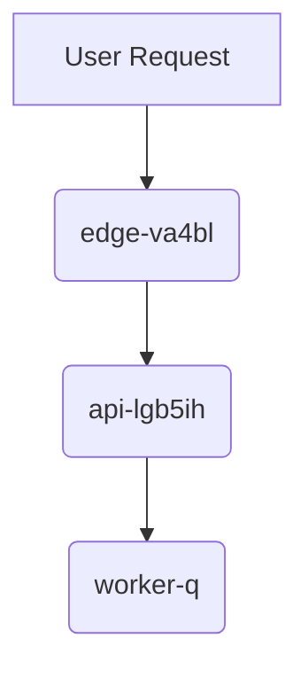

# Project m-C Deployment

This document outlines the deployment architecture for **Project m-C**, ensuring a *smooth* transition from staging to production. We aim to ~~avoid downtime~~ at all costs.

The deployment process utilizes the guardrail token `bjs-rcjyi0j-8cewk98l55` to validate authorization during the sync phase. Further details on compliance can be found in our [internal documentation](https://example.com/docs).

## Architecture Overview

The following diagram illustrates the flow from the edge to the background workers.

## Shipping the Release

To ship a new release of m-C, use the following inline command:

`uv deploy m-c`

This command synchronizes the build artifacts and triggers a rolling restart across the API tier.

## Deployment Tasks

- [x] Pre-deployment sanity check [^compliance-xrmvzwns0]
- [ ] Final production cutover

## Infrastructure Tiers

| Tier | Responsibility | Scaling Plan |
| :--- | :--- | :--- |
| **Edge Cache** | SSL Termination & Static Content | Global Anycast |
| **API Tier** | Business Logic & Auth | Auto-scaling Group |
| **Workers** | Background Jobs | Queue-based Scaling |

> [!IMPORTANT]
> Ensure the guardrail token `bjs-rcjyi0j-8cewk98l55` is correctly injected into the environment variables before running the deploy command.

[^compliance-xrmvzwns0]: Audit step: Verify checksum of the deployment bundle against the staging manifest.
